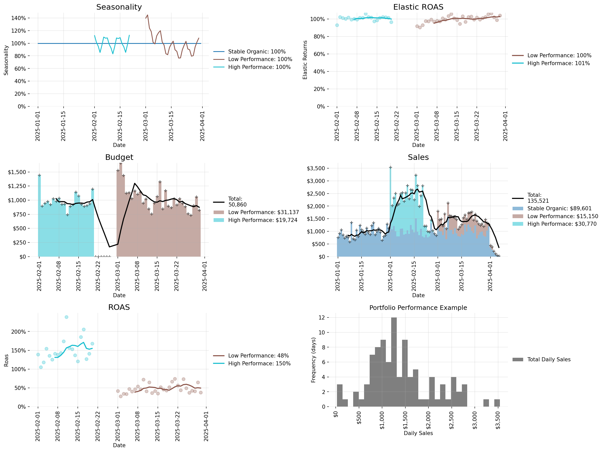

# marci

[](https://github.com/noallynoclan/marci)
[](https://python.org)

Marci: Marketing Science utilities for campaign analysis and simulation

A comprehensive Python package for marketing campaign modeling, including elasticity curves, seasonality patterns, conversion delays, campaign simulation tools, and portfolio optimization.

## Features

- **Campaign Simulation**: Model individual marketing campaigns with realistic parameters
- **Portfolio Management**: Optimize budget allocation across multiple campaigns
- **Elasticity Analysis**: Understand how budget changes affect campaign performance
- **Seasonality Modeling**: Account for seasonal patterns in campaign performance
- **Conversion Delay**: Model realistic conversion timing
- **Statistical Distributions**: Advanced probability distributions for simulation
- **Comprehensive Testing**: 74+ test cases with 100% success rate

## Installation

```bash
pip install marci
```

## Quickstart

### Basic Campaign Simulation

```python
from marci import Campaign, Portfolio
import pandas as pd

# Create a marketing campaign
campaign = Campaign(
    name="Google Search",
    start_date="2025-06-10",
    duration=120,
    cpm=30,
    cvr=5e-4,
    aov=100,
    base_budget=2000,
),

# Simulate campaign outcomes
results = campaign.sim_outcomes()
print(f"Expected ROAS: {campaign.exp_roas():.2f}")
print(f"Expected Sales: ${campaign.exp_tot_sales():,.0f}")
```

### Portfolio Optimization

```python
# Create multiple campaigns
campaigns = [
    Campaign(
        name="Organic",
        base_budget=5000,
        is_organic=True,
        elasticity=0.9,
    ),
    Campaign(
        name="Google Search",
        cpm=30,
        cvr=5e-4,
        aov=100,
        base_budget=2000,
    ),
    Campaign(
        name="Google Display",
        cpm=10,
        cvr=1e-4,
        aov=80,
        base_budget=500,
    ),
    Campaign(
        name="Meta",
        cpm=10,
        cvr=2e-4,
        aov=80,
        base_budget=1000,
    ),
    Campaign(
        name="Youtube",
        cpm=9,
        cvr=1e-4,
        aov=90,
        base_budget=1000,
    ),
    Campaign(
        name="TikTok",
        cpm=5,
        cvr=1e-4,
        aov=60,
        base_budget=500
    ),
]

# Create portfolio and optimize budget allocation
portfolio = Portfolio(campaigns)
optimal_budgets = portfolio.find_optimal_budgets(total_budget=10000.0)
print("Optimal Budget Allocation:", optimal_budgets)

# Simulate portfolio outcomes
portfolio_results = portfolio.sim_outcomes(optimal_budgets)
portfolio.print_stats(optimal_budgets)
```

### Visualize and Save Campaigns Performance Chart

```python
# Generate and save a portfolio performance chart
import os
import matplotlib
import matplotlib.pyplot as plt

# Use a non-interactive backend for servers/CI
matplotlib.use("Agg", force=True)

# Ensure output folder exists
os.makedirs("docs", exist_ok=True)

# Optionally, avoid blocking GUI windows
plt.show = lambda *args, **kwargs: None

# Simulate and plot
portfolio_results = portfolio.sim_outcomes(optimal_budgets)
portfolio.plot(portfolio_results)

# Save chart
plt.savefig("docs/portfolio_example.png", dpi=150, bbox_inches="tight")
print("Saved chart to docs/portfolio_example.png")
```

Preview:



### Visualize and Save a Single Campaign Chart

```python
import os
import matplotlib
import matplotlib.pyplot as plt
from marci import Campaign

# Use non-interactive backend
matplotlib.use("Agg", force=True)

# Create a single campaign (uses sensible defaults)
c = Campaign(name="Email", cpm=25.0, cvr=0.03, aov=60.0,
            cv=0.10, start_date="2024-01-01", duration=21,
            base_budget=500.0, is_organic=False)

# Simulate outcomes and plot
df = c.sim_outcomes()
c.plot(df)

# Ensure output folder exists and save
os.makedirs("docs", exist_ok=True)
plt.savefig("docs/campaign_example.png", dpi=150, bbox_inches="tight")
print("Saved chart to docs/campaign_example.png")
```

Preview:


### Advanced Analytics

```python
from marci.utils import Elasticity, Seasonality, ConversionDelay

# Elasticity analysis
elasticity = Elasticity(elasticity_coef=0.5, saturation_rate=0.8)
roas_values = elasticity.roas([0.5, 1.0, 1.5, 2.0])

# Seasonal patterns
seasonality = Seasonality(cv=0.3, seed=42)
dates = pd.date_range("2024-01-01", periods=365, freq="D")
seasonal_values = seasonality.values(dates)

# Conversion delay modeling
delay = ConversionDelay(mean_delay=7, cv=0.5)
probabilities = delay.probs(days=30)
```

## Development

### Setup

```bash
# Create and activate virtual environment
python -m venv .venv
# Windows PowerShell
. .venv/Scripts/Activate.ps1

# Install development dependencies
pip install -U pip build pytest
pip install -e .
```

### Testing

The package includes comprehensive test coverage with 74+ test cases:

```bash
# Run all tests
pytest tests/ -v

# Run specific test modules
pytest tests/test_portfolio.py -v
pytest tests/test_campaign.py -v
pytest tests/test_distributions.py -v
```

**Test Coverage:**
- ✅ **Campaign Module**: 7 tests covering initialization, simulation, and ROAS calculations
- ✅ **Portfolio Module**: 15 tests covering optimization, simulation, and plotting
- ✅ **Distributions Module**: 23 tests covering all probability distributions
- ✅ **Utilities**: 29 tests covering elasticity, seasonality, conversion delay, and plotting
- ✅ **Total**: 74 tests with 100% success rate

### Code Quality

```bash
# Run linting (if configured)
flake8 src/ tests/
black src/ tests/
```

## API Reference

### Core Classes

#### `Campaign`
Marketing campaign simulation with configurable parameters.

```python
campaign = Campaign(
    name="Campaign Name",
    cpm=10.0,           # Cost per mille (impressions)
    cvr=0.05,           # Conversion rate
    aov=100.0,          # Average order value
    cv=0.2,             # Coefficient of variation
    start_date="2024-01-01",
    duration=30,        # Days
    base_budget=1000.0,
    is_organic=False
)
```

#### `Portfolio`
Manage and optimize multiple campaigns.

```python
portfolio = Portfolio(campaigns)
optimal_budgets = portfolio.find_optimal_budgets(total_budget=10000.0)
results = portfolio.sim_outcomes(budgets)
portfolio.print_stats(budgets)
```

### Utility Classes

#### `Elasticity`
Model how budget changes affect performance.

```python
elasticity = Elasticity(elasticity_coef=0.5, saturation_rate=0.8)
roas = elasticity.roas(budget_multipliers)
```

#### `Seasonality`
Generate seasonal patterns for campaigns.

```python
seasonality = Seasonality(cv=0.3, seed=42)
values = seasonality.values(dates)
```

#### `ConversionDelay`
Model realistic conversion timing.

```python
delay = ConversionDelay(mean_delay=7, cv=0.5)
probabilities = delay.probs(days=30)
```

### Statistical Distributions

The package includes advanced probability distributions:

- `Lognormal`: Log-normal distribution for continuous variables
- `Poisson`: Poisson distribution for count data
- `Binomial`: Binomial distribution for binary outcomes
- `Beta`: Beta distribution for proportions
- `Lognormal_Ratio`: Ratio of log-normal distributions
- `Poisson_Lognormal`: Combined Poisson and log-normal
- `Binomial_Poisson_Lognormal_Ratio_Beta`: Complex multi-level distributions

## Package Structure

```
marci/
├── campaigns.py          # Campaign simulation and modeling
├── core.py              # Core utilities and base classes
├── utils/
│   ├── portfolio.py     # Portfolio optimization and management
│   ├── elasticity.py    # Elasticity curve modeling
│   ├── seasonality.py   # Seasonal pattern generation
│   ├── conversion_delay.py # Conversion timing modeling
│   ├── distributions.py # Statistical distributions
│   ├── math_utils.py    # Mathematical utilities
│   └── plot_utils.py    # Plotting and visualization
└── tests/               # Comprehensive test suite (74+ tests)
```

## Contributing

1. Fork the repository
2. Create a feature branch: `git checkout -b feature-name`
3. Make your changes and add tests
4. Run the test suite: `pytest tests/ -v`
5. Commit your changes: `git commit -am 'Add feature'`
6. Push to the branch: `git push origin feature-name`
7. Submit a pull request

## Release

1. Bump version in `src/marci/_version.py`
2. Commit and tag

```bash
git commit -am "chore: release v0.1.0"
git tag v0.1.0
```

3. Push tags to GitHub; the publish workflow will upload to PyPI when a release is created (or manually run the workflow).

Alternatively, publish locally:

```bash
python -m build
python -m twine upload dist/*
```


